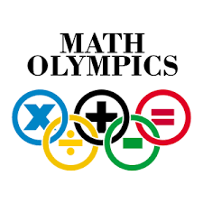

I participated in my high school's olympiad math team and our team went to a competation of all the high schools in Hawaiian. It is an interesting experience for me because I got chance to meet with students from other school and compete with them. I also learned how to do teamwork from this competation. It also is a chance for me to evaluate my mathematic level and to know what I should work on.   
