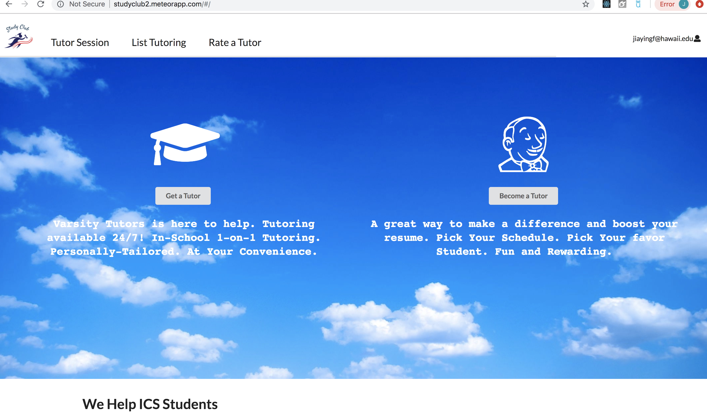

Visit our app at: <a href='http://studyclub2.meteorapp.com/'>study club</a>

StudyClub is a Meteor application for UHM ICS students to self-organize face-to-face study groups around a course and/or specific homework or project topic.

Important design goals for Study Buddy are:

To encourage use of ICSpace among ICS students
To minimize risk of inappropriate encounters by requiring all meetings to occur in ICSpace.
To encourage face-to-face interaction among ICS students.

I am responsible for creating the admin landing page and the rating page. I also designed the landing page with my teammates. This project gave me a chance to reflect on myself. From this project, I strengthened my software development and teamwork skills. I learned how to develop an app and how to be a good team members. 
