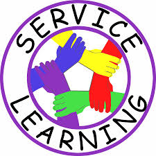

In the first summer of my college, I went to participated in the service learning at Palolo Ohana Learning Center. It was an excellent experience to communicate with children and to help them for their schoolworks and to understand their needs.

Through the experience, I had a deep undderstanding of the culture diversity since all the children from the center all from different places, such as Micronesia, Asia, Hawaiian, etc. By talking to them, I could see the cultural influence on them. Also, I improved my communication skill by helping them. 
